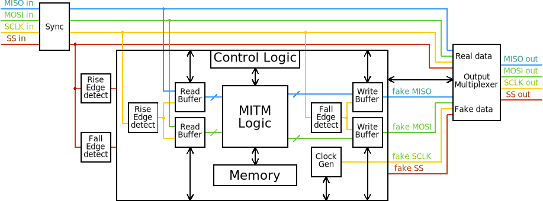

## Description
This directory contains FPGA code and related scripts.

## Directory structure

* **src/** - dVerilog source code of all modules and PCF files for different FPGAs

* **test/** - simulation test benches written in System Verilog for all modules in *src/*

* **docs/** - various documentation files (module diagrams, etc.)

## Dependencies

* **ICARUS Verilog**: https://github.com/steveicarus/iverilog

* **yosys**: https://github.com/YosysHQ/yosys

* **nextpnr** (specifically *nextpnr-ice40*): https://github.com/YosysHQ/nextpnr

* **Project Icestorm**: https://github.com/YosysHQ/icestorm

## How to build

* make simulate will generate simulation files (.vcd) for all tests (output in *sim/* directory)

* make bin will build binary files for all FPGAs

* make rpt will generate timing constraint report files (output in *report/* directory)

## Verilog Design Scheme
_A diagram representing how the main modules are interconnected:_

